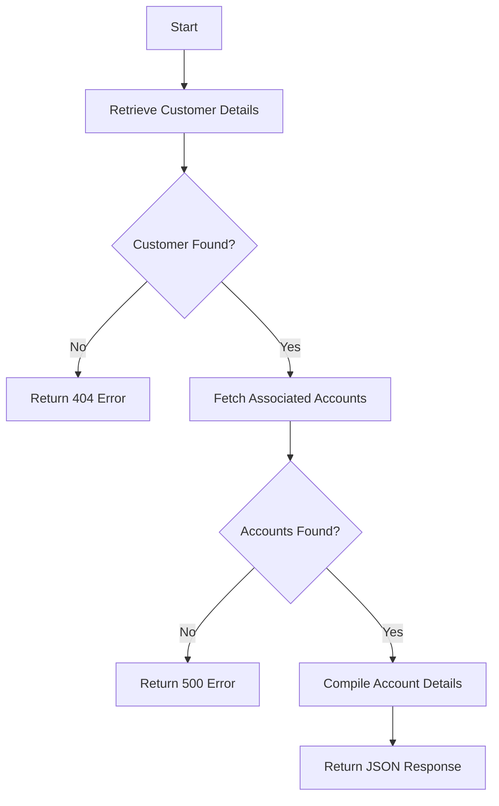

This document will cover the process of retrieving customer accounts, which includes:

1. Retrieving customer details
2. Fetching associated accounts
3. Handling database connections
4. Compiling and returning the response.

Technical document: <SwmLink doc-title="Retrieving Customer Accounts Flow">[Retrieving Customer Accounts Flow](/.swm/retrieving-customer-accounts-flow.cvqkt20v.sw.md)</SwmLink>

# [Retrieving Customer Details](https://app.swimm.io/repos/Z2l0aHViJTNBJTNBY2ljcy1iYW5raW5nLXNhbXBsZS1hcHBsaWNhdGlvbi1jYnNhLUlCTS1EZW1vLUdQVCUzQSUzQVN3aW1tLURlbW8=/docs/cvqkt20v#retrieving-customer-details)

The process begins by attempting to retrieve the customer's details using their unique customer ID. This step ensures that the customer exists in the system. If the customer ID is invalid or the customer is not found, a 404 error is returned. This step is crucial for verifying the existence of the customer before proceeding to fetch their accounts.

# [Fetching Associated Accounts](https://app.swimm.io/repos/Z2l0aHViJTNBJTNBY2ljcy1iYW5raW5nLXNhbXBsZS1hcHBsaWNhdGlvbi1jYnNhLUlCTS1EZW1vLUdQVCUzQSUzQVN3aW1tLURlbW8=/docs/cvqkt20v#fetching-accounts)

Once the customer details are successfully retrieved, the next step is to fetch the accounts associated with that customer. This involves querying the database using the customer's ID and sort code. If the accounts are successfully retrieved, they are compiled into an array. If there is an error during this process, a 500 error is returned. This step ensures that all relevant accounts are gathered for the customer.

# [Handling Database Connections](https://app.swimm.io/repos/Z2l0aHViJTNBJTNBY2ljcy1iYW5raW5nLXNhbXBsZS1hcHBsaWNhdGlvbi1jYnNhLUlCTS1EZW1vLUdQVCUzQSUzQVN3aW1tLURlbW8=/docs/cvqkt20v#opening-a-database-connection)

To fetch the accounts, a connection to the database must be established. This step involves checking if a connection already exists for the current task. If not, a new connection is created. This ensures that the system can access the necessary data from the database. Proper connection management is essential for maintaining the integrity and performance of the system.

# [Compiling and Returning the Response](https://app.swimm.io/repos/Z2l0aHViJTNBJTNBY2ljcy1iYW5raW5nLXNhbXBsZS1hcHBsaWNhdGlvbi1jYnNhLUlCTS1EZW1vLUdQVCUzQSUzQVN3aW1tLURlbW8=/docs/cvqkt20v#handling-customer-retrieval-and-account-fetching)

After successfully retrieving the customer details and associated accounts, the final step is to compile this information into a JSON response. This response includes all the account details and is returned to the requester with a 200 status code. This step ensures that the end user receives a comprehensive and structured response containing all the necessary account information.

&nbsp;

*This is an auto-generated document by Swimm 🌊 and has not yet been verified by a human*

<SwmMeta version="3.0.0" repo-id="Z2l0aHViJTNBJTNBY2ljcy1iYW5raW5nLXNhbXBsZS1hcHBsaWNhdGlvbi1jYnNhLUlCTS1EZW1vLUdQVCUzQSUzQVN3aW1tLURlbW8=" repo-name="cics-banking-sample-application-cbsa-IBM-Demo-GPT">Powered by [Swimm](/)</SwmMeta>
