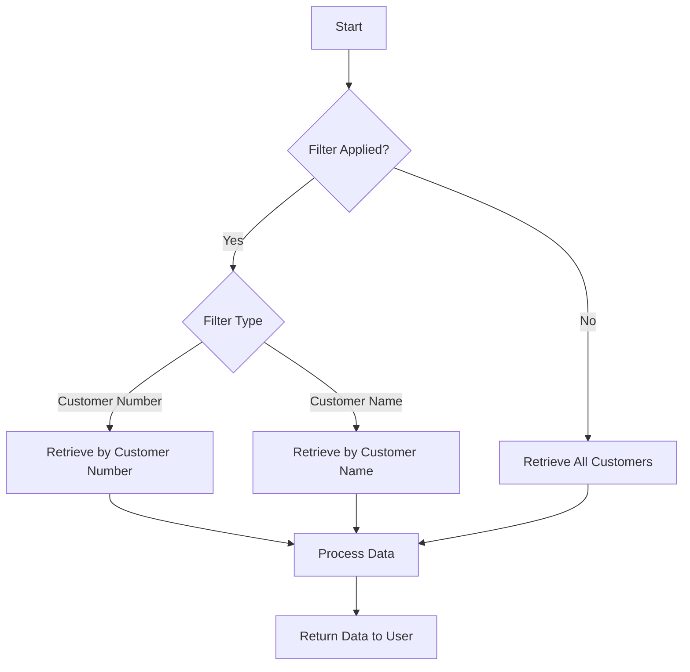

This document will cover the process of retrieving customer data, which includes:

1. Checking for applied filters
2. Retrieving customer data based on filters
3. Handling pagination
4. Processing and returning data to the user.

Technical document: <SwmLink doc-title="Retrieving Customer Data Flow">[Retrieving Customer Data Flow](/.swm/retrieving-customer-data-flow.jqozr6a2.sw.md)</SwmLink>

# [Checking for Applied Filters](https://app.swimm.io/repos/Z2l0aHViJTNBJTNBY2ljcy1iYW5raW5nLXNhbXBsZS1hcHBsaWNhdGlvbi1jYnNhLUlCTS1EZW1vLUdQVCUzQSUzQVN3aW1tLURlbW8=/docs/jqozr6a2#filtering-and-retrieving-customer-data)

The process begins by determining if any filters are applied to the customer data request. Filters can be based on customer number or customer name. If no filter is applied, the system will proceed to retrieve all customer data. This step ensures that the data retrieval process is tailored to the user's specific needs, improving the relevance and efficiency of the data provided.

# [Retrieving Customer Data Based on Filters](https://app.swimm.io/repos/Z2l0aHViJTNBJTNBY2ljcy1iYW5raW5nLXNhbXBsZS1hcHBsaWNhdGlvbi1jYnNhLUlCTS1EZW1vLUdQVCUzQSUzQVN3aW1tLURlbW8=/docs/jqozr6a2#filtering-and-retrieving-customer-data)

If a filter is applied, the system checks the type of filter. For a customer number filter, the system retrieves data for the specific customer number provided. For a customer name filter, the system retrieves data for customers whose names match the filter criteria. This step ensures that the data returned is specific to the user's query, enhancing the user experience by providing precise information.

# [Handling Pagination](https://app.swimm.io/repos/Z2l0aHViJTNBJTNBY2ljcy1iYW5raW5nLXNhbXBsZS1hcHBsaWNhdGlvbi1jYnNhLUlCTS1EZW1vLUdQVCUzQSUzQVN3aW1tLURlbW8=/docs/jqozr6a2#retrieving-customers-with-pagination)

To manage large sets of customer data, the system supports pagination. This means that the data is divided into manageable chunks or pages. Users can specify the number of records per page (limit) and the starting point (offset) for the data retrieval. Pagination ensures that the system can handle large volumes of data efficiently, providing a smoother and faster user experience.

# [Processing and Returning Data to the User](https://app.swimm.io/repos/Z2l0aHViJTNBJTNBY2ljcy1iYW5raW5nLXNhbXBsZS1hcHBsaWNhdGlvbi1jYnNhLUlCTS1EZW1vLUdQVCUzQSUzQVN3aW1tLURlbW8=/docs/jqozr6a2#filtering-and-retrieving-customer-data)

Once the relevant customer data is retrieved, it is processed to ensure it is in a format suitable for the user. This involves organizing the data and possibly converting it into a user-friendly format. The processed data is then returned to the user, completing the data retrieval process. This step ensures that the user receives the data in a clear and usable format, enhancing the overall user experience.

&nbsp;

*This is an auto-generated document by Swimm 🌊 and has not yet been verified by a human*

<SwmMeta version="3.0.0" repo-id="Z2l0aHViJTNBJTNBY2ljcy1iYW5raW5nLXNhbXBsZS1hcHBsaWNhdGlvbi1jYnNhLUlCTS1EZW1vLUdQVCUzQSUzQVN3aW1tLURlbW8=" repo-name="cics-banking-sample-application-cbsa-IBM-Demo-GPT">Powered by [Swimm](/)</SwmMeta>
