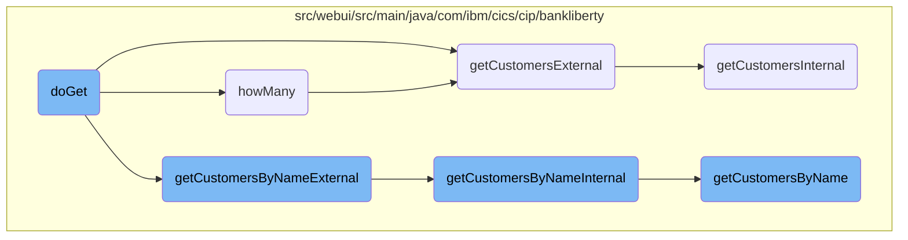

In this document, we will explain the process of retrieving customer data. The process involves filtering customer data based on various criteria such as customer number or name, and handling pagination.

The flow starts by checking if there is any filter applied. If no filter is applied, it retrieves all customers. If a filter is applied, it checks the type of filter (e.g., customer number or name) and retrieves the relevant customer data. The data is then processed and returned to the user.

# Flow drill down



<SwmSnippet path="/src/webui/src/main/java/com/ibm/cics/cip/bankliberty/webui/data_access/CustomerList.java" line="149">

---

## Filtering and retrieving customer data

The <SwmToken path="src/webui/src/main/java/com/ibm/cics/cip/bankliberty/webui/data_access/CustomerList.java" pos="149:5:5" line-data="	public void doGet(int limit, int offset, String filter) throws IOException">`doGet`</SwmToken> method is responsible for retrieving customer data based on different filters such as customer number, customer name, or no filter at all. It uses the <SwmToken path="src/webui/src/main/java/com/ibm/cics/cip/bankliberty/webui/data_access/CustomerList.java" pos="152:1:1" line-data="		CustomerResource myCustomerResource = new CustomerResource();">`CustomerResource`</SwmToken> class to fetch the data and processes the response to populate the <SwmToken path="src/webui/src/main/java/com/ibm/cics/cip/bankliberty/webui/data_access/CustomerList.java" pos="32:8:8" line-data="	private List&lt;Customer&gt; listOfCustomers = new ArrayList&lt;&gt;();">`listOfCustomers`</SwmToken>.

```java
	public void doGet(int limit, int offset, String filter) throws IOException
	{

		CustomerResource myCustomerResource = new CustomerResource();

		Response myCustomerResponse = null;

		String myCustomerString = null;

		try
		{
			if (filter.length() == 0)
			{

				myCustomerResponse = myCustomerResource
						.getCustomersExternal(limit, offset, false);

			}
			if (filter.startsWith(" AND CUSTOMER_NUMBER = "))
			{

```

---

</SwmSnippet>

<SwmSnippet path="/src/webui/src/main/java/com/ibm/cics/cip/bankliberty/webui/data_access/CustomerList.java" line="67">

---

### Counting customers based on filter

The <SwmToken path="src/webui/src/main/java/com/ibm/cics/cip/bankliberty/webui/data_access/CustomerList.java" pos="67:5:5" line-data="	private void howMany(String filter)">`howMany`</SwmToken> method counts the number of customers that match a given filter. It uses the <SwmToken path="src/webui/src/main/java/com/ibm/cics/cip/bankliberty/webui/data_access/CustomerList.java" pos="70:1:1" line-data="		CustomerResource myCustomerResource = new CustomerResource();">`CustomerResource`</SwmToken> class to fetch the count and updates the <SwmToken path="src/webui/src/main/java/com/ibm/cics/cip/bankliberty/webui/data_access/CustomerList.java" pos="36:5:5" line-data="	private int count;">`count`</SwmToken> attribute accordingly.

```java
	private void howMany(String filter)
	{

		CustomerResource myCustomerResource = new CustomerResource();
		Response myCustomerResponse = null;

		// 0123456789012345678901234

		try
		{
			if (filter.startsWith(" AND CUSTOMER_NAME like '"))
			{

				String customerNameFilter = filter.substring(25);
				customerNameFilter = customerNameFilter.substring(0,
						customerNameFilter.length() - 1);

				myCustomerResponse = myCustomerResource
						.getCustomersByNameExternal(customerNameFilter, 0, 0,
								true);
				String myCustomersString = myCustomerResponse.getEntity()
```

---

</SwmSnippet>

<SwmSnippet path="/src/webui/src/main/java/com/ibm/cics/cip/bankliberty/api/json/CustomerResource.java" line="940">

---

### Retrieving customers with pagination

The <SwmToken path="src/webui/src/main/java/com/ibm/cics/cip/bankliberty/api/json/CustomerResource.java" pos="942:5:5" line-data="	public Response getCustomersExternal(@QueryParam(&quot;limit&quot;) Integer limit,">`getCustomersExternal`</SwmToken> method retrieves a list of customers with pagination support. It delegates the actual data retrieval to the <SwmToken path="src/webui/src/main/java/com/ibm/cics/cip/bankliberty/api/json/CustomerResource.java" pos="954:7:7" line-data="		Response myResponse = getCustomersInternal(limit, offset,">`getCustomersInternal`</SwmToken> method.

```java
	@GET
	@Produces(MediaType.APPLICATION_JSON)
	public Response getCustomersExternal(@QueryParam("limit") Integer limit,
			@QueryParam("offset") Integer offset,
			@QueryParam("countOnly") Boolean countOnly)
	{
		logger.entering(this.getClass().getName(),
				"getCustomersExternal(Integer limit, Integer offset, Boolean countOnly) "
						+ limit + " " + offset + " " + countOnly);
		boolean countOnlyReal = false;
		if (countOnly != null)
		{
			countOnlyReal = countOnly.booleanValue();
		}
		Response myResponse = getCustomersInternal(limit, offset,
				countOnlyReal);
		HBankDataAccess myHBankDataAccess = new HBankDataAccess();
		myHBankDataAccess.terminate();
		logger.exiting(this.getClass().getName(),
				"getCustomersExternal(Integer limit, Integer offset, Boolean countOnly)",
				myResponse);
```

---

</SwmSnippet>

<SwmSnippet path="/src/webui/src/main/java/com/ibm/cics/cip/bankliberty/api/json/CustomerResource.java" line="1057">

---

### Retrieving customers by name with pagination

The <SwmToken path="src/webui/src/main/java/com/ibm/cics/cip/bankliberty/api/json/CustomerResource.java" pos="1060:5:5" line-data="	public Response getCustomersByNameExternal(@QueryParam(&quot;name&quot;) String name,">`getCustomersByNameExternal`</SwmToken> method retrieves customers by their name with pagination support. It delegates the actual data retrieval to the <SwmToken path="src/webui/src/main/java/com/ibm/cics/cip/bankliberty/api/json/CustomerResource.java" pos="1099:5:5" line-data="	public Response getCustomersByNameInternal(@QueryParam(&quot;name&quot;) String name,">`getCustomersByNameInternal`</SwmToken> method.

```java
	@GET
	@Path("/name")
	@Produces(MediaType.APPLICATION_JSON)
	public Response getCustomersByNameExternal(@QueryParam("name") String name,
			@QueryParam("limit") Integer limit,
			@QueryParam("offset") Integer offset,
			@QueryParam("countOnly") Boolean countOnly)
	{
		logger.entering(this.getClass().getName(),
				"getCustomersByNameExternal(String name, Integer limit, Integer offset, Boolean countOnly) "
						+ name + " " + limit + " " + offset + " " + countOnly);

		boolean countOnlyReal = false;
		if (countOnly != null)
		{
			countOnlyReal = countOnly.booleanValue();
		}
		if (offset == null)
		{
			offset = 0;
		}
```

---

</SwmSnippet>

<SwmSnippet path="/src/webui/src/main/java/com/ibm/cics/cip/bankliberty/api/json/CustomerResource.java" line="1099">

---

### Internal method for retrieving customers by name

The <SwmToken path="src/webui/src/main/java/com/ibm/cics/cip/bankliberty/api/json/CustomerResource.java" pos="1099:5:5" line-data="	public Response getCustomersByNameInternal(@QueryParam(&quot;name&quot;) String name,">`getCustomersByNameInternal`</SwmToken> method performs the actual retrieval of customers by their name. It supports both counting and listing of customers.

```java
	public Response getCustomersByNameInternal(@QueryParam("name") String name,
			@QueryParam("limit") int limit, @QueryParam("offset") int offset,
			boolean countOnly)
	{
		logger.entering(this.getClass().getName(),
				"getCustomersByNameInternal(String name, Integer limit, Integer offset, Boolean countOnly) "
						+ name + " " + limit + " " + offset + " " + countOnly);
		Integer sortCode = this.getSortCode();

		JSONObject response = new JSONObject();
		JSONArray customers = null;

		if (countOnly)
		{
			com.ibm.cics.cip.bankliberty.web.vsam.Customer vsamCustomer = new com.ibm.cics.cip.bankliberty.web.vsam.Customer();
			long numberOfCustomers = 0;
			numberOfCustomers = vsamCustomer
					.getCustomersByNameCountOnly(sortCode.intValue(), name);
			response.put(JSON_NUMBER_OF_CUSTOMERS, numberOfCustomers);
		}
		else
```

---

</SwmSnippet>

<SwmSnippet path="/src/webui/src/main/java/com/ibm/cics/cip/bankliberty/api/json/CustomerResource.java" line="965">

---

### Internal method for retrieving customers

The <SwmToken path="src/webui/src/main/java/com/ibm/cics/cip/bankliberty/api/json/CustomerResource.java" pos="965:5:5" line-data="	public Response getCustomersInternal(@QueryParam(&quot;limit&quot;) Integer limit,">`getCustomersInternal`</SwmToken> method performs the actual retrieval of customers with pagination support. It supports both counting and listing of customers.

```java
	public Response getCustomersInternal(@QueryParam("limit") Integer limit,
			@QueryParam("offset") Integer offset, boolean countOnly)
	{
		logger.entering(this.getClass().getName(),
				"getCustomersInternal(Integer limit, Integer offset, Boolean countOnly) "
						+ limit + " " + offset + " " + countOnly);
		Integer sortCode = this.getSortCode();

		JSONObject response = new JSONObject();
		JSONArray customers = null;

		if (offset == null)
		{
			offset = 0;
		}

		if (limit == null)
		{
			limit = 250000;
		}

```

---

</SwmSnippet>

<SwmSnippet path="/src/webui/src/main/java/com/ibm/cics/cip/bankliberty/web/vsam/Customer.java" line="1118">

---

### Retrieving customers by name from VSAM

The <SwmToken path="src/webui/src/main/java/com/ibm/cics/cip/bankliberty/web/vsam/Customer.java" pos="1118:7:7" line-data="	public Customer[] getCustomersByName(int sortCode, int limit, int offset,">`getCustomersByName`</SwmToken> method retrieves customers by their name from a VSAM file. It handles the file browsing and filtering based on the provided sort code and name.

```java
	public Customer[] getCustomersByName(int sortCode, int limit, int offset,
			String name)
	{
		logger.entering(this.getClass().getName(),
				GET_CUSTOMERS_BY_NAME_WITH_OFFSET_AND_LIMIT);
		Customer[] temp = new Customer[1000000];

		int stored = 0;

		customerFile.setName(FILENAME);

		myCustomer = new CUSTOMER();

		holder = new RecordHolder();
		keyHolder = new KeyHolder();
		byte[] key = buildKey(sortCode, 0);

		// We need to convert the key to EBCDIC
		String keyString = new String(key);
		try
		{
```

---

</SwmSnippet>

&nbsp;

*This is an auto-generated document by Swimm 🌊 and has not yet been verified by a human*

<SwmMeta version="3.0.0" repo-id="Z2l0aHViJTNBJTNBY2ljcy1iYW5raW5nLXNhbXBsZS1hcHBsaWNhdGlvbi1jYnNhLUlCTS1EZW1vLUdQVCUzQSUzQVN3aW1tLURlbW8=" repo-name="cics-banking-sample-application-cbsa-IBM-Demo-GPT"><sup>Powered by [Swimm](/)</sup></SwmMeta>
