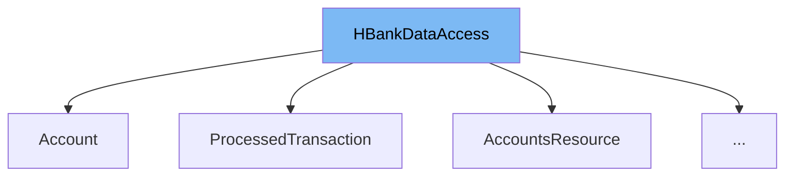

This document will cover the class <SwmToken path="src/webui/src/main/java/com/ibm/cics/cip/bankliberty/api/json/HBankDataAccess.java" pos="31:4:4" line-data="public class HBankDataAccess">`HBankDataAccess`</SwmToken>. We will cover:

1. What <SwmToken path="src/webui/src/main/java/com/ibm/cics/cip/bankliberty/api/json/HBankDataAccess.java" pos="31:4:4" line-data="public class HBankDataAccess">`HBankDataAccess`</SwmToken> is.
2. Variables and functions defined in <SwmToken path="src/webui/src/main/java/com/ibm/cics/cip/bankliberty/api/json/HBankDataAccess.java" pos="31:4:4" line-data="public class HBankDataAccess">`HBankDataAccess`</SwmToken>.
3. Usage example of <SwmToken path="src/webui/src/main/java/com/ibm/cics/cip/bankliberty/api/json/HBankDataAccess.java" pos="31:4:4" line-data="public class HBankDataAccess">`HBankDataAccess`</SwmToken> in `AccountsResource`.



# What is <SwmToken path="src/webui/src/main/java/com/ibm/cics/cip/bankliberty/api/json/HBankDataAccess.java" pos="31:4:4" line-data="public class HBankDataAccess">`HBankDataAccess`</SwmToken>

<SwmToken path="src/webui/src/main/java/com/ibm/cics/cip/bankliberty/api/json/HBankDataAccess.java" pos="31:4:4" line-data="public class HBankDataAccess">`HBankDataAccess`</SwmToken> is a class used to manage <SwmToken path="src/webui/src/main/java/com/ibm/cics/cip/bankliberty/api/json/HBankDataAccess.java" pos="27:27:27" line-data=" * This class is used to hold a HashTable which in turn holds Db2 Connections">`Db2`</SwmToken> database connections within a hash table. It provides methods to open, close, and manage these connections, ensuring efficient reuse and proper logging.

<SwmSnippet path="/src/webui/src/main/java/com/ibm/cics/cip/bankliberty/api/json/HBankDataAccess.java" line="31">

---

# Variables and functions

The constructor <SwmToken path="src/webui/src/main/java/com/ibm/cics/cip/bankliberty/api/json/HBankDataAccess.java" pos="31:4:4" line-data="public class HBankDataAccess">`HBankDataAccess`</SwmToken> initializes the logging configuration and creates a new hash table if it does not already exist.

```java
public class HBankDataAccess
{


	protected Connection conn = null;

	static int connectionCount = 0;

	private static final String DB2CONN = "DB2CONN";

	@SuppressWarnings("rawtypes")
	static HashMap cornedBeef = null;

	private static Logger logger = Logger
			.getLogger("com.ibm.cics.cip.bankliberty.api.json");


	public HBankDataAccess()
	{
		sortOutLogging();
		// If the hashmap 'cornedBeef' does not exist then create a new
```

---

</SwmSnippet>

<SwmSnippet path="/src/webui/src/main/java/com/ibm/cics/cip/bankliberty/api/json/HBankDataAccess.java" line="62">

---

The function <SwmToken path="src/webui/src/main/java/com/ibm/cics/cip/bankliberty/api/json/HBankDataAccess.java" pos="62:7:7" line-data="	private static void createHashMap()">`createHashMap`</SwmToken> initializes the static hash table <SwmToken path="src/webui/src/main/java/com/ibm/cics/cip/bankliberty/api/json/HBankDataAccess.java" pos="64:1:1" line-data="		cornedBeef = new HashMap&lt;&gt;();">`cornedBeef`</SwmToken>.

```java
	private static void createHashMap()
	{
		cornedBeef = new HashMap<>();

	}
```

---

</SwmSnippet>

<SwmSnippet path="/src/webui/src/main/java/com/ibm/cics/cip/bankliberty/api/json/HBankDataAccess.java" line="69">

---

The function <SwmToken path="src/webui/src/main/java/com/ibm/cics/cip/bankliberty/api/json/HBankDataAccess.java" pos="69:5:5" line-data="	protected void openConnection()">`openConnection`</SwmToken> opens a connection to the <SwmToken path="src/webui/src/main/java/com/ibm/cics/cip/bankliberty/api/json/HBankDataAccess.java" pos="27:27:27" line-data=" * This class is used to hold a HashTable which in turn holds Db2 Connections">`Db2`</SwmToken> database. It checks if a connection already exists for the current task and reuses it if possible. Otherwise, it creates a new connection.

```java
	protected void openConnection()
	{
		// Open a connection to the DB2 database
		logger.entering(this.getClass().getName(), "openConnection()");

		Integer taskNumberInteger = Task.getTask().getTaskNumber();
		String db2ConnString = DB2CONN.concat(taskNumberInteger.toString());
		logger.log(Level.FINE,
				() -> "Attempting to get DB2CONN for task number "
						+ taskNumberInteger.toString());
		this.conn = (Connection) cornedBeef.get(db2ConnString);
		if (this.conn == null)
		{
			HBankDataAccess.incrementConnCount();
			logger.log(Level.FINE,
					() -> "Attempting to create DB2CONN for task number "
							+ taskNumberInteger.toString());
			// Attempt to open a connection
			openConnectionInternal();
			logger.log(Level.FINE,
					() -> "Creation succcessful for DB2CONN for task number "
```

---

</SwmSnippet>

<SwmSnippet path="/src/webui/src/main/java/com/ibm/cics/cip/bankliberty/api/json/HBankDataAccess.java" line="117">

---

The function <SwmToken path="src/webui/src/main/java/com/ibm/cics/cip/bankliberty/api/json/HBankDataAccess.java" pos="117:5:5" line-data="	public void terminate()">`terminate`</SwmToken> is a public method that calls <SwmToken path="src/webui/src/main/java/com/ibm/cics/cip/bankliberty/api/json/HBankDataAccess.java" pos="120:1:1" line-data="		closeConnection();">`closeConnection`</SwmToken> to close the database connection.

```java
	public void terminate()
	{
		// Close the connection
		closeConnection();
	}
```

---

</SwmSnippet>

<SwmSnippet path="/src/webui/src/main/java/com/ibm/cics/cip/bankliberty/api/json/HBankDataAccess.java" line="124">

---

The function <SwmToken path="src/webui/src/main/java/com/ibm/cics/cip/bankliberty/api/json/HBankDataAccess.java" pos="124:5:5" line-data="	public void closeConnection()">`closeConnection`</SwmToken> closes the connection to the <SwmToken path="src/webui/src/main/java/com/ibm/cics/cip/bankliberty/api/json/HBankDataAccess.java" pos="27:27:27" line-data=" * This class is used to hold a HashTable which in turn holds Db2 Connections">`Db2`</SwmToken> database and removes it from the hash table.

```java
	public void closeConnection()
	{
		// Close the connection to the DB2 database
		logger.entering(this.getClass().getName(), "closeConnection()");

		HBankDataAccess.decrementConnCount();

		Integer taskNumberInterger = Task.getTask().getTaskNumber();
		String db2ConnString = DB2CONN.concat(taskNumberInterger.toString());
		this.conn = (Connection) cornedBeef.get(db2ConnString);
		// If there is an open connection
		if (this.conn != null)
		{
			logger.log(Level.FINE, () -> "We have a DB2 connection to close");
			try
			{
				logger.log(Level.FINE, () -> "Syncpointing");
				Task.getTask().commit();
				// Close the connection
				this.conn.close();
				cornedBeef.remove(db2ConnString);
```

---

</SwmSnippet>

<SwmSnippet path="/src/webui/src/main/java/com/ibm/cics/cip/bankliberty/api/json/HBankDataAccess.java" line="162">

---

The function <SwmToken path="src/webui/src/main/java/com/ibm/cics/cip/bankliberty/api/json/HBankDataAccess.java" pos="163:3:3" line-data="	void openConnectionInternal()">`openConnectionInternal`</SwmToken> is a helper method that actually opens a new connection to the <SwmToken path="src/webui/src/main/java/com/ibm/cics/cip/bankliberty/api/json/HBankDataAccess.java" pos="27:27:27" line-data=" * This class is used to hold a HashTable which in turn holds Db2 Connections">`Db2`</SwmToken> database using JNDI lookup.

```java
	@SuppressWarnings("unchecked")
	void openConnectionInternal()
	{
		logger.entering(this.getClass().getName(), "openConnectionInternal");
		String jndiString = "jdbc/defaultCICSDataSource";
		Context ctx;

		try
		{
			ctx = new InitialContext();
			DataSource ds = (DataSource) ctx.lookup(jndiString);
			logger.log(Level.FINE, () -> "jndi string is " + jndiString);
			// If there is no current connection
			if (this.conn == null)
			{
				logger.log(Level.FINE,
						() -> "About to attempt to get DB2 connection");
				// Try and get a connection
				this.conn = ds.getConnection();
				this.conn.setTransactionIsolation(
						Connection.TRANSACTION_READ_UNCOMMITTED);
```

---

</SwmSnippet>

<SwmSnippet path="/src/webui/src/main/java/com/ibm/cics/cip/bankliberty/api/json/HBankDataAccess.java" line="209">

---

The function <SwmToken path="src/webui/src/main/java/com/ibm/cics/cip/bankliberty/api/json/HBankDataAccess.java" pos="209:5:5" line-data="	protected void sortOutLogging()">`sortOutLogging`</SwmToken> configures the logging settings for the class.

```java
	protected void sortOutLogging()
	{
		try
		{
			LogManager.getLogManager().readConfiguration();
		}
		catch (SecurityException | IOException e)
		{
			logger.severe(e.toString());
		}
	}
```

---

</SwmSnippet>

<SwmSnippet path="/src/webui/src/main/java/com/ibm/cics/cip/bankliberty/api/json/HBankDataAccess.java" line="222">

---

The function <SwmToken path="src/webui/src/main/java/com/ibm/cics/cip/bankliberty/api/json/HBankDataAccess.java" pos="222:7:7" line-data="	private static void incrementConnCount()">`incrementConnCount`</SwmToken> increments the static variable <SwmToken path="src/webui/src/main/java/com/ibm/cics/cip/bankliberty/api/json/HBankDataAccess.java" pos="224:3:3" line-data="		HBankDataAccess.connectionCount++;">`connectionCount`</SwmToken> to keep track of the number of open connections.

```java
	private static void incrementConnCount()
	{
		HBankDataAccess.connectionCount++;
	}
```

---

</SwmSnippet>

<SwmSnippet path="/src/webui/src/main/java/com/ibm/cics/cip/bankliberty/api/json/HBankDataAccess.java" line="228">

---

The function <SwmToken path="src/webui/src/main/java/com/ibm/cics/cip/bankliberty/api/json/HBankDataAccess.java" pos="228:7:7" line-data="	private static void decrementConnCount()">`decrementConnCount`</SwmToken> decrements the static variable <SwmToken path="src/webui/src/main/java/com/ibm/cics/cip/bankliberty/api/json/HBankDataAccess.java" pos="230:3:3" line-data="		HBankDataAccess.connectionCount--;">`connectionCount`</SwmToken> to keep track of the number of open connections.

```java
	private static void decrementConnCount()
	{
		HBankDataAccess.connectionCount--;
	}
```

---

</SwmSnippet>

&nbsp;

*This is an auto-generated document by Swimm 🌊 and has not yet been verified by a human*

<SwmMeta version="3.0.0" repo-id="Z2l0aHViJTNBJTNBY2ljcy1iYW5raW5nLXNhbXBsZS1hcHBsaWNhdGlvbi1jYnNhLUlCTS1EZW1vLUdQVCUzQSUzQVN3aW1tLURlbW8=" repo-name="cics-banking-sample-application-cbsa-IBM-Demo-GPT"><sup>Powered by [Swimm](/)</sup></SwmMeta>
