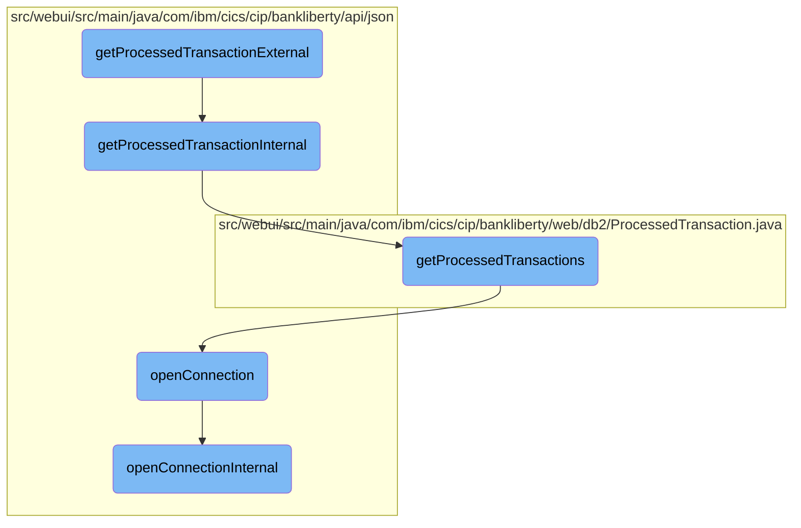

In this document, we will explain the process of retrieving and processing transaction data. The process involves initiating the transaction retrieval, fetching the data from the database, and formatting the data into a JSON response.

The flow starts by initiating the transaction retrieval process. It then fetches the transaction data from the database. After fetching the data, it processes each transaction to format it into a JSON response. Finally, it terminates the database connection.

# Flow drill down



<SwmSnippet path="/src/webui/src/main/java/com/ibm/cics/cip/bankliberty/api/json/ProcessedTransactionResource.java" line="94">

---

## Retrieving and processing transaction data

The <SwmToken path="src/webui/src/main/java/com/ibm/cics/cip/bankliberty/api/json/ProcessedTransactionResource.java" pos="96:5:5" line-data="	public Response getProcessedTransactionExternal(">`getProcessedTransactionExternal`</SwmToken> function initiates the process of retrieving transaction data. It calls <SwmToken path="src/webui/src/main/java/com/ibm/cics/cip/bankliberty/api/json/ProcessedTransactionResource.java" pos="100:7:7" line-data="		Response myResponse = getProcessedTransactionInternal(limit, offset);">`getProcessedTransactionInternal`</SwmToken> to fetch the data and then terminates the database connection.

```java
	@GET
	@Produces(MediaType.APPLICATION_JSON)
	public Response getProcessedTransactionExternal(
			@QueryParam(LIMIT) Integer limit,
			@QueryParam(OFFSET) Integer offset)
	{
		Response myResponse = getProcessedTransactionInternal(limit, offset);
		HBankDataAccess myHBankDataAccess = new HBankDataAccess();
		myHBankDataAccess.terminate();
		return myResponse;
	}
```

---

</SwmSnippet>

<SwmSnippet path="/src/webui/src/main/java/com/ibm/cics/cip/bankliberty/api/json/ProcessedTransactionResource.java" line="107">

---

The <SwmToken path="src/webui/src/main/java/com/ibm/cics/cip/bankliberty/api/json/ProcessedTransactionResource.java" pos="107:5:5" line-data="	public Response getProcessedTransactionInternal(">`getProcessedTransactionInternal`</SwmToken> function handles the core logic of fetching and processing transaction data. It sets default values for <SwmToken path="src/webui/src/main/java/com/ibm/cics/cip/bankliberty/api/json/ProcessedTransactionResource.java" pos="108:9:9" line-data="			@QueryParam(LIMIT) Integer limit,">`limit`</SwmToken> and <SwmToken path="src/webui/src/main/java/com/ibm/cics/cip/bankliberty/api/json/ProcessedTransactionResource.java" pos="109:9:9" line-data="			@QueryParam(OFFSET) Integer offset)">`offset`</SwmToken> if they are not provided, retrieves the transactions from the database, and processes each transaction to format it into a JSON response.

```java
	public Response getProcessedTransactionInternal(
			@QueryParam(LIMIT) Integer limit,
			@QueryParam(OFFSET) Integer offset)
	{

		if (offset == null)
		{
			offset = 0;
		}
		if (limit == null)
		{
			limit = 250000;
		}
		JSONObject response = new JSONObject();
		JSONArray processedTransactionsJSON = null;
		int numberOfProcessedTransactions = 0;
		Integer sortCode = this.getSortCode();

		com.ibm.cics.cip.bankliberty.web.db2.ProcessedTransaction myProcessedTransaction = new com.ibm.cics.cip.bankliberty.web.db2.ProcessedTransaction();
		com.ibm.cics.cip.bankliberty.web.db2.ProcessedTransaction[] processedTransactions = null;
		
```

---

</SwmSnippet>

<SwmSnippet path="/src/webui/src/main/java/com/ibm/cics/cip/bankliberty/web/db2/ProcessedTransaction.java" line="224">

---

The <SwmToken path="src/webui/src/main/java/com/ibm/cics/cip/bankliberty/web/db2/ProcessedTransaction.java" pos="224:7:7" line-data="	public ProcessedTransaction[] getProcessedTransactions(int sortCode,">`getProcessedTransactions`</SwmToken> function in <SwmToken path="src/webui/src/main/java/com/ibm/cics/cip/bankliberty/web/db2/ProcessedTransaction.java" pos="224:3:3" line-data="	public ProcessedTransaction[] getProcessedTransactions(int sortCode,">`ProcessedTransaction`</SwmToken> class executes the SQL query to fetch transaction records from the database. It processes each record to handle different transaction types and formats the transaction date and time.

```java
	public ProcessedTransaction[] getProcessedTransactions(int sortCode,
			Integer limit, Integer offset)
	{
		logger.entering(this.getClass().getName(), GET_PROCESSED_TRANSACTIONS);

		ProcessedTransaction[] temp = new ProcessedTransaction[limit];

		this.offset = offset.intValue();
		this.limit = limit.intValue();

		StringBuilder myStringBuilder = new StringBuilder();

		for (int i = Integer.toString(sortCode).length(); i < SORT_CODE_LENGTH; i++)
		{
			myStringBuilder.append('0');
		}

		myStringBuilder.append(Integer.toString(sortCode));
		String sortCodeString = myStringBuilder.toString();

		openConnection();
```

---

</SwmSnippet>

<SwmSnippet path="/src/webui/src/main/java/com/ibm/cics/cip/bankliberty/api/json/HBankDataAccess.java" line="69">

---

The <SwmToken path="src/webui/src/main/java/com/ibm/cics/cip/bankliberty/api/json/HBankDataAccess.java" pos="69:5:5" line-data="	protected void openConnection()">`openConnection`</SwmToken> function manages the database connection. It checks if a connection already exists and reuses it if possible, otherwise, it opens a new connection.

```java
	protected void openConnection()
	{
		// Open a connection to the DB2 database
		logger.entering(this.getClass().getName(), "openConnection()");

		Integer taskNumberInteger = Task.getTask().getTaskNumber();
		String db2ConnString = DB2CONN.concat(taskNumberInteger.toString());
		logger.log(Level.FINE,
				() -> "Attempting to get DB2CONN for task number "
						+ taskNumberInteger.toString());
		this.conn = (Connection) cornedBeef.get(db2ConnString);
		if (this.conn == null)
		{
			HBankDataAccess.incrementConnCount();
			logger.log(Level.FINE,
					() -> "Attempting to create DB2CONN for task number "
							+ taskNumberInteger.toString());
			// Attempt to open a connection
			openConnectionInternal();
			logger.log(Level.FINE,
					() -> "Creation succcessful for DB2CONN for task number "
```

---

</SwmSnippet>

<SwmSnippet path="/src/webui/src/main/java/com/ibm/cics/cip/bankliberty/api/json/HBankDataAccess.java" line="162">

---

The <SwmToken path="src/webui/src/main/java/com/ibm/cics/cip/bankliberty/api/json/HBankDataAccess.java" pos="163:3:3" line-data="	void openConnectionInternal()">`openConnectionInternal`</SwmToken> function is responsible for the actual creation of a new database connection if no existing connection is found or if the existing connection is closed.

```java
	@SuppressWarnings("unchecked")
	void openConnectionInternal()
	{
		logger.entering(this.getClass().getName(), "openConnectionInternal");
		String jndiString = "jdbc/defaultCICSDataSource";
		Context ctx;

		try
		{
			ctx = new InitialContext();
			DataSource ds = (DataSource) ctx.lookup(jndiString);
			logger.log(Level.FINE, () -> "jndi string is " + jndiString);
			// If there is no current connection
			if (this.conn == null)
			{
				logger.log(Level.FINE,
						() -> "About to attempt to get DB2 connection");
				// Try and get a connection
				this.conn = ds.getConnection();
				this.conn.setTransactionIsolation(
						Connection.TRANSACTION_READ_UNCOMMITTED);
```

---

</SwmSnippet>

&nbsp;

*This is an auto-generated document by Swimm 🌊 and has not yet been verified by a human*

<SwmMeta version="3.0.0" repo-id="Z2l0aHViJTNBJTNBY2ljcy1iYW5raW5nLXNhbXBsZS1hcHBsaWNhdGlvbi1jYnNhLUlCTS1EZW1vLUdQVCUzQSUzQVN3aW1tLURlbW8=" repo-name="cics-banking-sample-application-cbsa-IBM-Demo-GPT"><sup>Powered by [Swimm](/)</sup></SwmMeta>
