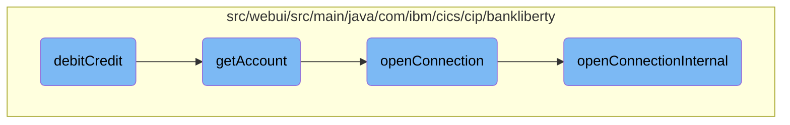
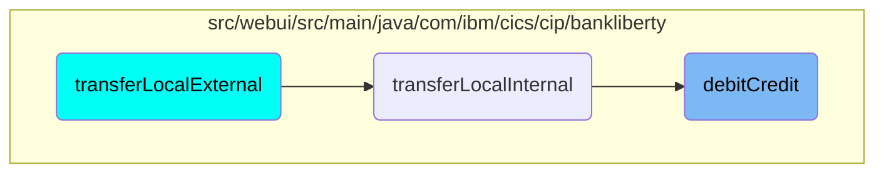

This document explains the process of updating an account balance by either debiting or crediting a specified amount. The process involves retrieving account details, establishing a database connection, and updating the account balance.

The flow starts by retrieving the account details using the account number and sort code. If the account is found, a connection to the database is opened. The specified amount is then added to the current balance, and the new balance is updated in the database.

# Flow drill down



<SwmSnippet path="/src/webui/src/main/java/com/ibm/cics/cip/bankliberty/web/db2/Account.java" line="1000">

---

## Handling account balance updates

The <SwmToken path="src/webui/src/main/java/com/ibm/cics/cip/bankliberty/web/db2/Account.java" pos="1000:5:5" line-data="	public boolean debitCredit(BigDecimal apiAmount)">`debitCredit`</SwmToken> method is responsible for updating the account balance. It first retrieves the account details using <SwmToken path="src/webui/src/main/java/com/ibm/cics/cip/bankliberty/web/db2/Account.java" pos="1003:9:9" line-data="		Account temp = this.getAccount(">`getAccount`</SwmToken>. If the account is found, it opens a database connection using <SwmToken path="src/webui/src/main/java/com/ibm/cics/cip/bankliberty/web/db2/Account.java" pos="1015:1:1" line-data="		openConnection();">`openConnection`</SwmToken>. The method then calculates the new balances by adding the <SwmToken path="src/webui/src/main/java/com/ibm/cics/cip/bankliberty/web/db2/Account.java" pos="1000:9:9" line-data="	public boolean debitCredit(BigDecimal apiAmount)">`apiAmount`</SwmToken> to the current balances and updates the database with the new values.

```java
	public boolean debitCredit(BigDecimal apiAmount)
	{
		logger.entering(this.getClass().getName(), DEBIT_CREDIT_ACCOUNT);
		Account temp = this.getAccount(
				Integer.parseInt(this.getAccountNumber()),
				Integer.parseInt(this.getSortcode()));
		if (temp == null)
		{
			logger.log(Level.WARNING,
					() -> "Unable to find account " + this.getAccountNumber());
			logger.exiting(this.getClass().getName(), DEBIT_CREDIT_ACCOUNT,
					false);
			return false;
		}

		openConnection();
		String accountNumberString = temp.getAccountNumber();

		String sortCodeString = padSortCode(
				Integer.parseInt(this.getSortcode()));
		String sql1 = SQL_SELECT;
```

---

</SwmSnippet>

<SwmSnippet path="/src/webui/src/main/java/com/ibm/cics/cip/bankliberty/web/db2/Account.java" line="402">

---

### Retrieving account details

The <SwmToken path="src/webui/src/main/java/com/ibm/cics/cip/bankliberty/web/db2/Account.java" pos="402:5:5" line-data="	public Account getAccount(int accountNumber, int sortCode)">`getAccount`</SwmToken> method retrieves account details from the database. It constructs SQL queries to fetch account information based on the account number and sort code. If the account number is 99999999, it fetches the latest account details. Otherwise, it fetches the specific account details.

```java
	public Account getAccount(int accountNumber, int sortCode)
	{
		logger.entering(this.getClass().getName(), GET_ACCOUNT + accountNumber);
		openConnection();
		Account temp = null;

		String sortCodeString = padSortCode(sortCode);
		String sql9999 = "SELECT * from ACCOUNT where ACCOUNT_EYECATCHER LIKE 'ACCT' AND ACCOUNT_SORTCODE like ? order by ACCOUNT_NUMBER DESC";
		String sql = SQL_SELECT;
		try (PreparedStatement stmt9999 = conn.prepareStatement(sql9999);
				PreparedStatement stmt = conn.prepareStatement(sql);)
		{
			if (accountNumber == 99999999)
			{

				logger.log(Level.FINE, () -> PRE_SELECT_MSG + sql9999 + ">");

				stmt9999.setString(1, sortCodeString);
				ResultSet rs = stmt9999.executeQuery();
				if (rs.next())
				{
```

---

</SwmSnippet>

<SwmSnippet path="/src/webui/src/main/java/com/ibm/cics/cip/bankliberty/api/json/HBankDataAccess.java" line="69">

---

### Opening a database connection

The <SwmToken path="src/webui/src/main/java/com/ibm/cics/cip/bankliberty/api/json/HBankDataAccess.java" pos="69:5:5" line-data="	protected void openConnection()">`openConnection`</SwmToken> method ensures a connection to the <SwmToken path="src/webui/src/main/java/com/ibm/cics/cip/bankliberty/api/json/HBankDataAccess.java" pos="71:13:13" line-data="		// Open a connection to the DB2 database">`DB2`</SwmToken> database is established. It checks if a connection already exists for the current task. If not, it calls <SwmToken path="src/webui/src/main/java/com/ibm/cics/cip/bankliberty/api/json/HBankDataAccess.java" pos="87:1:1" line-data="			openConnectionInternal();">`openConnectionInternal`</SwmToken> to create a new connection.

```java
	protected void openConnection()
	{
		// Open a connection to the DB2 database
		logger.entering(this.getClass().getName(), "openConnection()");

		Integer taskNumberInteger = Task.getTask().getTaskNumber();
		String db2ConnString = DB2CONN.concat(taskNumberInteger.toString());
		logger.log(Level.FINE,
				() -> "Attempting to get DB2CONN for task number "
						+ taskNumberInteger.toString());
		this.conn = (Connection) cornedBeef.get(db2ConnString);
		if (this.conn == null)
		{
			HBankDataAccess.incrementConnCount();
			logger.log(Level.FINE,
					() -> "Attempting to create DB2CONN for task number "
							+ taskNumberInteger.toString());
			// Attempt to open a connection
			openConnectionInternal();
			logger.log(Level.FINE,
					() -> "Creation succcessful for DB2CONN for task number "
```

---

</SwmSnippet>

<SwmSnippet path="/src/webui/src/main/java/com/ibm/cics/cip/bankliberty/api/json/HBankDataAccess.java" line="162">

---

### Establishing a new connection

The <SwmToken path="src/webui/src/main/java/com/ibm/cics/cip/bankliberty/api/json/HBankDataAccess.java" pos="163:3:3" line-data="	void openConnectionInternal()">`openConnectionInternal`</SwmToken> method establishes a new connection to the <SwmToken path="src/webui/src/main/java/com/ibm/cics/cip/bankliberty/api/json/HBankDataAccess.java" pos="178:17:17" line-data="						() -&gt; &quot;About to attempt to get DB2 connection&quot;);">`DB2`</SwmToken> database using JNDI lookup. It sets the transaction isolation level and stores the connection in a map for reuse.

```java
	@SuppressWarnings("unchecked")
	void openConnectionInternal()
	{
		logger.entering(this.getClass().getName(), "openConnectionInternal");
		String jndiString = "jdbc/defaultCICSDataSource";
		Context ctx;

		try
		{
			ctx = new InitialContext();
			DataSource ds = (DataSource) ctx.lookup(jndiString);
			logger.log(Level.FINE, () -> "jndi string is " + jndiString);
			// If there is no current connection
			if (this.conn == null)
			{
				logger.log(Level.FINE,
						() -> "About to attempt to get DB2 connection");
				// Try and get a connection
				this.conn = ds.getConnection();
				this.conn.setTransactionIsolation(
						Connection.TRANSACTION_READ_UNCOMMITTED);
```

---

</SwmSnippet>

# Where is this flow used?

This flow is used once, in a flow starting from `transferLocalExternal` as represented in the following diagram:



&nbsp;

*This is an auto-generated document by Swimm 🌊 and has not yet been verified by a human*

<SwmMeta version="3.0.0" repo-id="Z2l0aHViJTNBJTNBY2ljcy1iYW5raW5nLXNhbXBsZS1hcHBsaWNhdGlvbi1jYnNhLUlCTS1EZW1vLUdQVCUzQSUzQVN3aW1tLURlbW8=" repo-name="cics-banking-sample-application-cbsa-IBM-Demo-GPT"><sup>Powered by [Swimm](/)</sup></SwmMeta>
