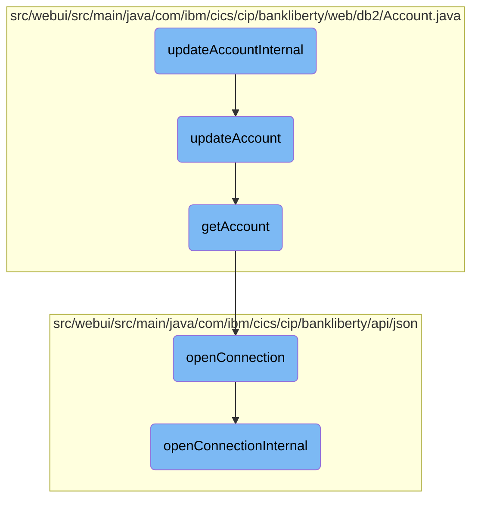
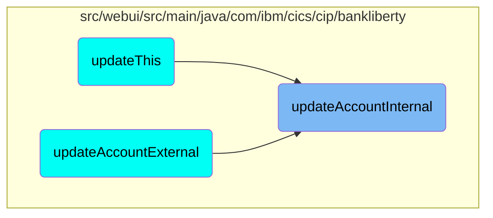

This document explains the process of updating an account's details. The process involves validating the account details, retrieving the existing account information, and updating the account with new details if all validations pass.

The flow starts by validating the account details provided. If the details are valid, it retrieves the existing account information from the database. Then, it updates the account with the new details provided. If the update is successful, it returns a success response with the updated account details. If any step fails, an appropriate error response is generated.

# Flow drill down



<SwmSnippet path="/src/webui/src/main/java/com/ibm/cics/cip/bankliberty/api/json/AccountsResource.java" line="652">

---

## Validating Account Details

The <SwmToken path="src/webui/src/main/java/com/ibm/cics/cip/bankliberty/api/json/AccountsResource.java" pos="65:14:14" line-data="	private static final String UPDATE_ACCOUNT_INTERNAL = &quot;updateAccountInternal(Long id, AccountJSON account)&quot;;">`updateAccountInternal`</SwmToken> function first validates the account details provided in the <SwmToken path="src/webui/src/main/java/com/ibm/cics/cip/bankliberty/api/json/AccountsResource.java" pos="57:16:16" line-data="	private static final String CREATE_ACCOUNT_INTERNAL = &quot;createAccountInternal(AccountJSON account)&quot;;">`AccountJSON`</SwmToken> object. It checks if the account type is valid, if the interest rate is within acceptable bounds, and if the sort code matches the bank's sort code. If any of these validations fail, an appropriate error response is generated and returned.

```java
		if (!(account.validateType(account.getAccountType().trim())))
		// If account type invalid
		{
			JSONObject error = new JSONObject();
			error.put(JSON_ERROR_MSG,
					ACC_TYPE_STRING + account.getAccountType() + NOT_SUPPORTED);
			logger.log(Level.WARNING, () -> (ACC_TYPE_STRING
					+ account.getAccountType() + NOT_SUPPORTED));
			myResponse = Response.status(400).entity(error.toString()).build();
			logger.exiting(this.getClass().getName(), UPDATE_ACCOUNT_INTERNAL,
					myResponse);
			return myResponse;
		}

		if (account.getInterestRate().doubleValue() < 0.00)
		{
			// If interest rate < 0
			JSONObject error = new JSONObject();
			error.put(JSON_ERROR_MSG, INTEREST_RATE_LESS_THAN_ZERO);
			logger.log(Level.WARNING, () -> (INTEREST_RATE_LESS_THAN_ZERO));
			myResponse = Response.status(400).entity(error.toString()).build();
```

---

</SwmSnippet>

<SwmSnippet path="/src/webui/src/main/java/com/ibm/cics/cip/bankliberty/api/json/AccountsResource.java" line="725">

---

## Updating the Account

If all validations pass, the function proceeds to update the account. It retrieves the existing account details using the <SwmToken path="src/webui/src/main/java/com/ibm/cics/cip/bankliberty/api/json/AccountsResource.java" pos="727:7:7" line-data="		db2Account = db2Account.getAccount(Integer.parseInt(account.getId()),">`getAccount`</SwmToken> method and then updates the account with the new details provided. If the update is successful, a success response with the updated account details is returned. If the update fails, an error response is generated.

```java
		com.ibm.cics.cip.bankliberty.web.db2.Account db2Account = new com.ibm.cics.cip.bankliberty.web.db2.Account();
		account.setId(id.toString());
		db2Account = db2Account.getAccount(Integer.parseInt(account.getId()),
				this.getSortCode().intValue());

		if (db2Account != null)
		{
			db2Account = db2Account.updateAccount(account);
			if (db2Account != null)
			{
				response.put(JSON_SORT_CODE, db2Account.getSortcode().trim());
				response.put("id", db2Account.getAccountNumber());
				response.put(JSON_CUSTOMER_NUMBER,
						db2Account.getCustomerNumber());
				response.put(JSON_ACCOUNT_TYPE, db2Account.getType().trim());
				response.put(JSON_AVAILABLE_BALANCE,
						BigDecimal.valueOf(db2Account.getAvailableBalance()));
				response.put(JSON_ACTUAL_BALANCE,
						BigDecimal.valueOf(db2Account.getActualBalance()));
				response.put(JSON_INTEREST_RATE,
						BigDecimal.valueOf(db2Account.getInterestRate()));
```

---

</SwmSnippet>

<SwmSnippet path="/src/webui/src/main/java/com/ibm/cics/cip/bankliberty/web/db2/Account.java" line="402">

---

### Retrieving Account Details

The <SwmToken path="src/webui/src/main/java/com/ibm/cics/cip/bankliberty/web/db2/Account.java" pos="402:5:5" line-data="	public Account getAccount(int accountNumber, int sortCode)">`getAccount`</SwmToken> function retrieves the account details from the database using the account number and sort code. It executes a SQL query to fetch the account details and returns an <SwmToken path="src/webui/src/main/java/com/ibm/cics/cip/bankliberty/web/db2/Account.java" pos="402:3:3" line-data="	public Account getAccount(int accountNumber, int sortCode)">`Account`</SwmToken> object with the retrieved details.

```java
	public Account getAccount(int accountNumber, int sortCode)
	{
		logger.entering(this.getClass().getName(), GET_ACCOUNT + accountNumber);
		openConnection();
		Account temp = null;

		String sortCodeString = padSortCode(sortCode);
		String sql9999 = "SELECT * from ACCOUNT where ACCOUNT_EYECATCHER LIKE 'ACCT' AND ACCOUNT_SORTCODE like ? order by ACCOUNT_NUMBER DESC";
		String sql = SQL_SELECT;
		try (PreparedStatement stmt9999 = conn.prepareStatement(sql9999);
				PreparedStatement stmt = conn.prepareStatement(sql);)
		{
			if (accountNumber == 99999999)
			{

				logger.log(Level.FINE, () -> PRE_SELECT_MSG + sql9999 + ">");

				stmt9999.setString(1, sortCodeString);
				ResultSet rs = stmt9999.executeQuery();
				if (rs.next())
				{
```

---

</SwmSnippet>

<SwmSnippet path="/src/webui/src/main/java/com/ibm/cics/cip/bankliberty/api/json/HBankDataAccess.java" line="69">

---

### Opening a Database Connection

The <SwmToken path="src/webui/src/main/java/com/ibm/cics/cip/bankliberty/api/json/HBankDataAccess.java" pos="69:5:5" line-data="	protected void openConnection()">`openConnection`</SwmToken> function ensures that a connection to the <SwmToken path="src/webui/src/main/java/com/ibm/cics/cip/bankliberty/api/json/HBankDataAccess.java" pos="71:13:13" line-data="		// Open a connection to the DB2 database">`DB2`</SwmToken> database is open. If a connection is not already open or is closed, it calls the <SwmToken path="src/webui/src/main/java/com/ibm/cics/cip/bankliberty/api/json/HBankDataAccess.java" pos="87:1:1" line-data="			openConnectionInternal();">`openConnectionInternal`</SwmToken> function to establish a new connection.

```java
	protected void openConnection()
	{
		// Open a connection to the DB2 database
		logger.entering(this.getClass().getName(), "openConnection()");

		Integer taskNumberInteger = Task.getTask().getTaskNumber();
		String db2ConnString = DB2CONN.concat(taskNumberInteger.toString());
		logger.log(Level.FINE,
				() -> "Attempting to get DB2CONN for task number "
						+ taskNumberInteger.toString());
		this.conn = (Connection) cornedBeef.get(db2ConnString);
		if (this.conn == null)
		{
			HBankDataAccess.incrementConnCount();
			logger.log(Level.FINE,
					() -> "Attempting to create DB2CONN for task number "
							+ taskNumberInteger.toString());
			// Attempt to open a connection
			openConnectionInternal();
			logger.log(Level.FINE,
					() -> "Creation succcessful for DB2CONN for task number "
```

---

</SwmSnippet>

<SwmSnippet path="/src/webui/src/main/java/com/ibm/cics/cip/bankliberty/api/json/HBankDataAccess.java" line="162">

---

### Establishing a New Database Connection

The <SwmToken path="src/webui/src/main/java/com/ibm/cics/cip/bankliberty/api/json/HBankDataAccess.java" pos="163:3:3" line-data="	void openConnectionInternal()">`openConnectionInternal`</SwmToken> function establishes a new connection to the <SwmToken path="src/webui/src/main/java/com/ibm/cics/cip/bankliberty/api/json/HBankDataAccess.java" pos="178:17:17" line-data="						() -&gt; &quot;About to attempt to get DB2 connection&quot;);">`DB2`</SwmToken> database using the JNDI lookup for the data source. It sets the transaction isolation level and stores the connection for reuse.

```java
	@SuppressWarnings("unchecked")
	void openConnectionInternal()
	{
		logger.entering(this.getClass().getName(), "openConnectionInternal");
		String jndiString = "jdbc/defaultCICSDataSource";
		Context ctx;

		try
		{
			ctx = new InitialContext();
			DataSource ds = (DataSource) ctx.lookup(jndiString);
			logger.log(Level.FINE, () -> "jndi string is " + jndiString);
			// If there is no current connection
			if (this.conn == null)
			{
				logger.log(Level.FINE,
						() -> "About to attempt to get DB2 connection");
				// Try and get a connection
				this.conn = ds.getConnection();
				this.conn.setTransactionIsolation(
						Connection.TRANSACTION_READ_UNCOMMITTED);
```

---

</SwmSnippet>

# Where is this flow used?

This flow is used multiple times in the codebase as represented in the following diagram:



&nbsp;

*This is an auto-generated document by Swimm 🌊 and has not yet been verified by a human*

<SwmMeta version="3.0.0" repo-id="Z2l0aHViJTNBJTNBY2ljcy1iYW5raW5nLXNhbXBsZS1hcHBsaWNhdGlvbi1jYnNhLUlCTS1EZW1vLUdQVCUzQSUzQVN3aW1tLURlbW8=" repo-name="cics-banking-sample-application-cbsa-IBM-Demo-GPT"><sup>Powered by [Swimm](/)</sup></SwmMeta>
