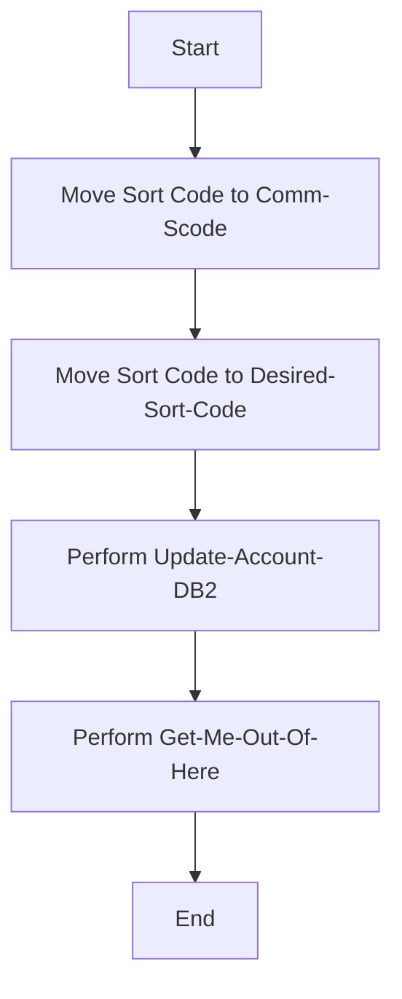

This document will cover the UPDACC program. We'll cover:

1. What the Program Does
2. Program Flow
3. Program Sections

## What the Program Does

The UPDACC program is designed to update account details in a <SwmToken path="src/base/cobol_src/UPDACC.cbl" pos="167:7:7" line-data="           PERFORM UPDATE-ACCOUNT-DB2">`DB2`</SwmToken> database. It receives all the fields that make up an account record as input, updates the associated account record in the <SwmToken path="src/base/cobol_src/UPDACC.cbl" pos="167:7:7" line-data="           PERFORM UPDATE-ACCOUNT-DB2">`DB2`</SwmToken> datastore, and ensures that only a limited number of fields can be changed. The program does not allow changes to the account balance and does not write any record to <SwmToken path="src/base/cobol_src/UPDACC.cbl" pos="22:22:22" line-data="      * the balance, no record needs to be written to PR0CTRAN (as the">`PR0CTRAN`</SwmToken>. If the account cannot be updated, a failure flag is returned to the calling program.

## Program Flow

This is a visualization of the flow:



<SwmSnippet path="/src/base/cobol_src/UPDACC.cbl" line="157">

---

### PREMIERE SECTION

First, the program initializes by moving the sort code to the communication area and the desired sort code. Then, it performs the <SwmToken path="src/base/cobol_src/UPDACC.cbl" pos="167:3:7" line-data="           PERFORM UPDATE-ACCOUNT-DB2">`UPDATE-ACCOUNT-DB2`</SwmToken> section to update the account information. Finally, it performs the <SwmToken path="src/base/cobol_src/UPDACC.cbl" pos="174:3:11" line-data="           PERFORM GET-ME-OUT-OF-HERE.">`GET-ME-OUT-OF-HERE`</SwmToken> section to finish the process.

```cobol
       PROCEDURE DIVISION.
       PREMIERE SECTION.
       A010.

           MOVE SORTCODE TO COMM-SCODE.
           MOVE SORTCODE TO DESIRED-SORT-CODE.

      *
      *           Update the account information
      *
           PERFORM UPDATE-ACCOUNT-DB2

      *
      *    The COMMAREA values have now been set so all we need to do
      *    is finish
      *

           PERFORM GET-ME-OUT-OF-HERE.

       A999.
           EXIT.
```

---

</SwmSnippet>

<SwmSnippet path="/src/base/cobol_src/UPDACC.cbl" line="180">

---

### <SwmToken path="src/base/cobol_src/UPDACC.cbl" pos="180:1:5" line-data="       UPDATE-ACCOUNT-DB2 SECTION.">`UPDATE-ACCOUNT-DB2`</SwmToken> SECTION

Next, the program positions itself at the matching account record by moving the account number and sort code to the host variables. It then executes an SQL SELECT statement to retrieve the account details. If the SELECT is successful, it updates the account type, interest rate, and overdraft limit fields. If the update is successful, it sets the success flag and moves the updated account details to the communication area.

```cobol
       UPDATE-ACCOUNT-DB2 SECTION.
       UAD010.

      *
      *    Position ourself at the matching account record
      *

           MOVE COMM-ACCNO TO DESIRED-ACC-NO.
           MOVE DESIRED-SORT-CODE TO HV-ACCOUNT-SORTCODE.
           MOVE DESIRED-ACC-NO TO HV-ACCOUNT-ACC-NO.

           EXEC SQL
              SELECT ACCOUNT_EYECATCHER,
                     ACCOUNT_CUSTOMER_NUMBER,
                     ACCOUNT_SORTCODE,
                     ACCOUNT_NUMBER,
                     ACCOUNT_TYPE,
                     ACCOUNT_INTEREST_RATE,
                     ACCOUNT_OPENED,
                     ACCOUNT_OVERDRAFT_LIMIT,
                     ACCOUNT_LAST_STATEMENT,
```

---

</SwmSnippet>

<SwmSnippet path="/src/base/cobol_src/UPDACC.cbl" line="381">

---

### <SwmToken path="src/base/cobol_src/UPDACC.cbl" pos="381:1:9" line-data="       GET-ME-OUT-OF-HERE SECTION.">`GET-ME-OUT-OF-HERE`</SwmToken> SECTION

Finally, the program executes a CICS RETURN command to end the transaction and return control to the calling program.

```cobol
       GET-ME-OUT-OF-HERE SECTION.
       GMOOH010.

           EXEC CICS RETURN
           END-EXEC.

       GMOOH999.
           EXIT.
```

---

</SwmSnippet>

&nbsp;

*This is an auto-generated document by Swimm 🌊 and has not yet been verified by a human*

<SwmMeta version="3.0.0" repo-id="Z2l0aHViJTNBJTNBY2ljcy1iYW5raW5nLXNhbXBsZS1hcHBsaWNhdGlvbi1jYnNhLUlCTS1EZW1vLUdQVCUzQSUzQVN3aW1tLURlbW8=" repo-name="cics-banking-sample-application-cbsa-IBM-Demo-GPT"><sup>Powered by [Swimm](/)</sup></SwmMeta>
