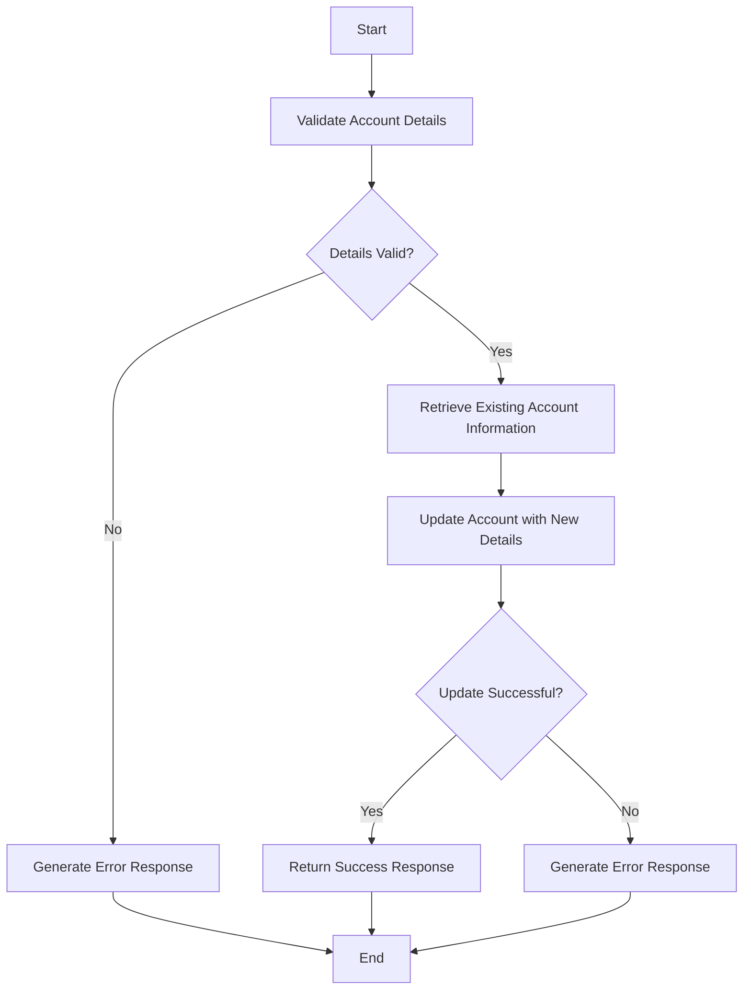

This document will cover the process of updating account details, which includes:

1. Validating the account details
2. Retrieving existing account information
3. Updating the account with new details
4. Handling success and error responses.

Technical document: <SwmLink doc-title="Updating Account Details Flow">[Updating Account Details Flow](/.swm/updating-account-details-flow.ili57ayj.sw.md)</SwmLink>

# [Validating Account Details](https://app.swimm.io/repos/Z2l0aHViJTNBJTNBY2ljcy1iYW5raW5nLXNhbXBsZS1hcHBsaWNhdGlvbi1jYnNhLUlCTS1EZW1vLUdQVCUzQSUzQVN3aW1tLURlbW8=/docs/ili57ayj#validating-account-details)

The process begins by validating the account details provided by the user. This includes checking if the account type is valid, ensuring the interest rate is within acceptable bounds, and verifying that the sort code matches the bank's sort code. If any of these validations fail, an appropriate error response is generated and returned to the user. This step ensures that only valid and consistent data is processed further.

# [Retrieving Existing Account Information](https://app.swimm.io/repos/Z2l0aHViJTNBJTNBY2ljcy1iYW5raW5nLXNhbXBsZS1hcHBsaWNhdGlvbi1jYnNhLUlCTS1EZW1vLUdQVCUzQSUzQVN3aW1tLURlbW8=/docs/ili57ayj#retrieving-account-details)

If the account details are valid, the next step is to retrieve the existing account information from the database. This involves querying the database using the account number and sort code to fetch the current details of the account. This step is crucial as it ensures that the system has the most up-to-date information before making any changes.

# [Updating the Account with New Details](https://app.swimm.io/repos/Z2l0aHViJTNBJTNBY2ljcy1iYW5raW5nLXNhbXBsZS1hcHBsaWNhdGlvbi1jYnNhLUlCTS1EZW1vLUdQVCUzQSUzQVN3aW1tLURlbW8=/docs/ili57ayj#updating-the-account)

Once the existing account information is retrieved, the system proceeds to update the account with the new details provided by the user. This step involves replacing the old account details with the new ones. If the update is successful, the system prepares a success response that includes the updated account details. This ensures that the user is informed about the successful update and can see the new account information.

# [Handling Success and Error Responses](https://app.swimm.io/repos/Z2l0aHViJTNBJTNBY2ljcy1iYW5raW5nLXNhbXBsZS1hcHBsaWNhdGlvbi1jYnNhLUlCTS1EZW1vLUdQVCUzQSUzQVN3aW1tLURlbW8=/docs/ili57ayj#updating-the-account)

After attempting to update the account, the system checks if the update was successful. If it was, a success response with the updated account details is returned to the user. If the update fails at any point, an appropriate error response is generated and returned. This step ensures that the user is always informed about the outcome of their request, whether it was successful or if there was an issue that needs to be addressed.

&nbsp;

*This is an auto-generated document by Swimm 🌊 and has not yet been verified by a human*

<SwmMeta version="3.0.0" repo-id="Z2l0aHViJTNBJTNBY2ljcy1iYW5raW5nLXNhbXBsZS1hcHBsaWNhdGlvbi1jYnNhLUlCTS1EZW1vLUdQVCUzQSUzQVN3aW1tLURlbW8=" repo-name="cics-banking-sample-application-cbsa-IBM-Demo-GPT">Powered by [Swimm](/)</SwmMeta>
