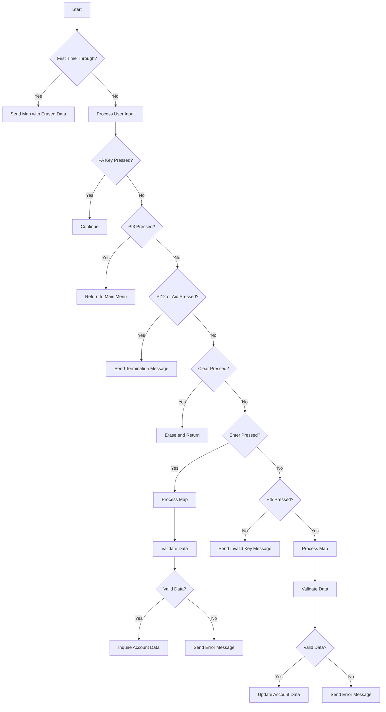

This document will cover the <SwmToken path="src/base/cobol_src/BNK1UAC.cbl" pos="16:6:6" line-data="       PROGRAM-ID. BNK1UAC.">`BNK1UAC`</SwmToken> program. We'll cover:

1. What the Program Does
2. Program Flow
3. Program Sections

## What the Program Does

The <SwmToken path="src/base/cobol_src/BNK1UAC.cbl" pos="16:6:6" line-data="       PROGRAM-ID. BNK1UAC.">`BNK1UAC`</SwmToken> program is designed to update account information within the BANKING application BMS suite. It handles various user interactions, such as sending maps, processing input data, validating data, and updating account records. The program ensures that the account information is correctly updated and provides feedback to the user based on the actions performed.

## Program Flow

This is a visualization of the flow:



<SwmSnippet path="/src/base/cobol_src/BNK1UAC.cbl" line="196">

---

### PREMIERE SECTION

First, the program evaluates the initial conditions and user inputs. It handles different user actions such as sending maps, returning to the main menu, sending termination messages, and processing map data based on the input received.

```cobol
       PROCEDURE DIVISION.
       PREMIERE SECTION.
       A010.

           EVALUATE TRUE
      *
      *       Is it the first time through? If so, send the map
      *       with erased (empty) data fields.
      *
              WHEN EIBCALEN = ZERO
                 MOVE LOW-VALUE TO BNK1UAO
                 MOVE -1 TO ACCNOL
                 SET SEND-ERASE TO TRUE
                 INITIALIZE WS-COMM-AREA
                 PERFORM SEND-MAP

      *
      *       If a PA key is pressed, just carry on
      *
              WHEN EIBAID = DFHPA1 OR DFHPA2 OR DFHPA3
                 CONTINUE
```

---

</SwmSnippet>

<SwmSnippet path="/src/base/cobol_src/BNK1UAC.cbl" line="366">

---

### <SwmToken path="src/base/cobol_src/BNK1UAC.cbl" pos="366:1:3" line-data="       PROCESS-MAP SECTION.">`PROCESS-MAP`</SwmToken> SECTION

Next, the program processes the map data. It retrieves data from the map, validates the received data, and performs actions based on the validation results, such as inquiring or updating account data.

```cobol
       PROCESS-MAP SECTION.
       PM010.
      *
      *    Retrieve the data from the map
      *
           PERFORM RECEIVE-MAP.
           MOVE 'Y' TO VALID-DATA-SW
      *
      *    If enter was pressed, validate the received data
      *
           IF EIBAID = DFHENTER
              PERFORM EDIT-DATA
      *
      *       If the data passes validation go on to
      *       get the account
      *
              IF VALID-DATA-SW = 'Y'
                 PERFORM INQ-ACC-DATA
              END-IF

           END-IF.
```

---

</SwmSnippet>

<SwmSnippet path="/src/base/cobol_src/BNK1UAC.cbl" line="413">

---

### <SwmToken path="src/base/cobol_src/BNK1UAC.cbl" pos="414:1:3" line-data="       RECEIVE-MAP SECTION.">`RECEIVE-MAP`</SwmToken> SECTION

Then, the program retrieves data from the map using the <SwmToken path="src/base/cobol_src/BNK1UAC.cbl" pos="419:1:1" line-data="           EXEC CICS">`EXEC`</SwmToken>` `<SwmToken path="src/base/cobol_src/BNK1UAC.cbl" pos="419:3:3" line-data="           EXEC CICS">`CICS`</SwmToken>` `<SwmToken path="src/base/cobol_src/BNK1UAC.cbl" pos="414:1:1" line-data="       RECEIVE-MAP SECTION.">`RECEIVE`</SwmToken>` `<SwmToken path="src/base/cobol_src/BNK1UAC.cbl" pos="414:3:3" line-data="       RECEIVE-MAP SECTION.">`MAP`</SwmToken> command. If the receive operation fails, it handles the error by linking to the Abend Handler program.

```cobol

       RECEIVE-MAP SECTION.
       RM010.
      *
      *    Retrieve the data
      *
           EXEC CICS
              RECEIVE MAP('BNK1UA')
              MAPSET('BNK1UAM')
              INTO(BNK1UAI)
              RESP(WS-CICS-RESP)
              RESP2(WS-CICS-RESP2)
           END-EXEC.

           IF WS-CICS-RESP NOT = DFHRESP(NORMAL)
      *
      *       Preserve the RESP and RESP2, then set up the
      *       standard ABEND info before getting the applid,
      *       date/time etc. and linking to the Abend Handler
      *       program.
      *
```

---

</SwmSnippet>

<SwmSnippet path="/src/base/cobol_src/BNK1UAC.cbl" line="491">

---

### <SwmToken path="src/base/cobol_src/BNK1UAC.cbl" pos="491:1:3" line-data="       EDIT-DATA SECTION.">`EDIT-DATA`</SwmToken> SECTION

Going into the next section, the program performs validation on the incoming fields to ensure that the data is in the correct format and meets the required criteria.

```cobol
       EDIT-DATA SECTION.
       ED010.
      *
      *    Perform validation on the incoming fields
      *
           IF ACCNOI NOT NUMERIC
              MOVE 'Please enter an account number.   ' TO
                 MESSAGEO
              MOVE 'N' TO VALID-DATA-SW
           END-IF.

       ED999.
           EXIT.
```

---

</SwmSnippet>

<SwmSnippet path="/src/base/cobol_src/BNK1UAC.cbl" line="506">

---

### <SwmToken path="src/base/cobol_src/BNK1UAC.cbl" pos="506:1:3" line-data="       VALIDATE-DATA SECTION.">`VALIDATE-DATA`</SwmToken> SECTION

Now, the program performs more detailed validation on the data, including checks for numeric values, date formats, and specific account type conditions. It ensures that all input data is valid before proceeding to the next steps.

```cobol
       VALIDATE-DATA SECTION.
       VD010.
      *
      *    Perform more validation
      *
           IF ACTYPEI NOT = 'CURRENT ' AND
           ACTYPEI NOT = 'SAVING  ' AND
           ACTYPEI NOT = 'LOAN    ' AND
           ACTYPEI NOT = 'MORTGAGE' AND
           ACTYPEI NOT = 'ISA     '

              MOVE SPACES TO MESSAGEO
              STRING 'Account Type must be CURRENT, SAVING, LOAN, '
                 'MORTGAGE or ISA' DELIMITED BY SIZE,
                 '. Then press PF5.' DELIMITED BY SIZE
              INTO MESSAGEO
              MOVE -1 to ACTYPEL
              MOVE 'N' TO VALID-DATA-SW
           END-IF.

           IF INTRTL = ZERO
```

---

</SwmSnippet>

<SwmSnippet path="/src/base/cobol_src/BNK1UAC.cbl" line="757">

---

### <SwmToken path="src/base/cobol_src/BNK1UAC.cbl" pos="757:1:5" line-data="       INQ-ACC-DATA SECTION.">`INQ-ACC-DATA`</SwmToken> SECTION

Then, the program sets up the fields required for the <SwmToken path="src/base/cobol_src/BNK1UAC.cbl" pos="760:15:15" line-data="      *    Set up the fields required by INQACC then link to it">`INQACC`</SwmToken> program and calls it to inquire about the account data. If the inquiry fails, it handles the error by linking to the Abend Handler program.

```cobol
       INQ-ACC-DATA SECTION.
       IAD010.
      *
      *    Set up the fields required by INQACC then link to it
      *
           INITIALIZE DFHCOMMAREA.

           MOVE ACCNOI TO COMM-ACCNO.
           SET COMM-PCB1-POINTER TO NULL.

           EXEC CICS LINK
              PROGRAM('INQACC')
              COMMAREA(DFHCOMMAREA)
              RESP(WS-CICS-RESP)
              RESP2(WS-CICS-RESP2)
              SYNCONRETURN
           END-EXEC.

           IF WS-CICS-RESP NOT = DFHRESP(NORMAL)
      *
      *       Preserve the RESP and RESP2, then set up the
```

---

</SwmSnippet>

<SwmSnippet path="/src/base/cobol_src/BNK1UAC.cbl" line="885">

---

### <SwmToken path="src/base/cobol_src/BNK1UAC.cbl" pos="885:1:5" line-data="       UPD-ACC-DATA SECTION.">`UPD-ACC-DATA`</SwmToken> SECTION

Next, the program sets up the fields required for the <SwmToken path="src/base/cobol_src/BNK1UAC.cbl" pos="888:15:15" line-data="      *    Set up the fields required by UPDACC then link to it">`UPDACC`</SwmToken> program and calls it to update the account data. It converts screen formats into proper numeric formats and handles any errors by linking to the Abend Handler program.

```cobol
       UPD-ACC-DATA SECTION.
       UAD010.
      *
      *    Set up the fields required by UPDACC then link to it
      *
           INITIALIZE DFHCOMMAREA.

           MOVE ACCNOI        TO COMM-ACCNO.
           IF ACCNOI = 99999999
             MOVE ACCNO2I        TO COMM-ACCNO
           END-IF
           MOVE CUSTNOI       TO COMM-CUSTNO.
           MOVE SORTCI        TO COMM-SCODE.
           MOVE ACTYPEI       TO COMM-ACC-TYPE.
           COMPUTE INTRTI-COMP-1 = FUNCTION NUMVAL(INTRTI).
           MOVE INTRTI-COMP-1 TO INT-RT-9.
           MOVE INT-RT-9      TO COMM-INT-RATE.
           MOVE OPENDDI       TO WS-DATE-SPLIT-DD.
           MOVE OPENMMI       TO  WS-DATE-SPLIT-MM.
           MOVE OPENYYI       TO WS-DATE-SPLIT-YY.
           MOVE WS-DATE-SPLIT TO COMM-OPENED.
```

---

</SwmSnippet>

<SwmSnippet path="/src/base/cobol_src/BNK1UAC.cbl" line="1068">

---

### <SwmToken path="src/base/cobol_src/BNK1UAC.cbl" pos="1068:1:3" line-data="       SEND-MAP SECTION.">`SEND-MAP`</SwmToken> SECTION

Then, the program sends the map data back to the user. It handles different scenarios such as sending erased data, sending data only, and sending data with an alarm. If the send operation fails, it handles the error by linking to the Abend Handler program.

```cobol
       SEND-MAP SECTION.
       SM010.
      *
      *    If the map needs to have its data erased
      *
           IF SEND-ERASE
              EXEC CICS SEND MAP('BNK1UA')
                 MAPSET('BNK1UAM')
                 FROM(BNK1UAO)
                 ERASE
                 CURSOR
                 RESP(WS-CICS-RESP)
                 RESP2(WS-CICS-RESP2)
              END-EXEC

              IF WS-CICS-RESP NOT = DFHRESP(NORMAL)
      *
      *          Preserve the RESP and RESP2, then set up the
      *          standard ABEND info before getting the applid,
      *          date/time etc. and linking to the Abend Handler
      *          program.
```

---

</SwmSnippet>

<SwmSnippet path="/src/base/cobol_src/BNK1UAC.cbl" line="1301">

---

### <SwmToken path="src/base/cobol_src/BNK1UAC.cbl" pos="1301:1:5" line-data="       SEND-TERMINATION-MSG SECTION.">`SEND-TERMINATION-MSG`</SwmToken> SECTION

Next, the program sends a termination message to the user, indicating the end of the session. If the send operation fails, it handles the error by linking to the Abend Handler program.

```cobol
       SEND-TERMINATION-MSG SECTION.
       STM010.
      *
      *    Send the termination message
      *
           EXEC CICS SEND TEXT
              FROM(END-OF-SESSION-MESSAGE)
              ERASE
              FREEKB
              RESP(WS-CICS-RESP)
              RESP2(WS-CICS-RESP2)
           END-EXEC.

           IF WS-CICS-RESP NOT = DFHRESP(NORMAL)
      *
      *       Preserve the RESP and RESP2, then set up the
      *       standard ABEND info before getting the applid,
      *       date/time etc. and linking to the Abend Handler
      *       program.
      *
              INITIALIZE ABNDINFO-REC
```

---

</SwmSnippet>

<SwmSnippet path="/src/base/cobol_src/BNK1UAC.cbl" line="1378">

---

### <SwmToken path="src/base/cobol_src/BNK1UAC.cbl" pos="1378:1:5" line-data="       ABEND-THIS-TASK SECTION.">`ABEND-THIS-TASK`</SwmToken> SECTION

Then, the program displays the failure information and abends the task using the <SwmToken path="src/base/cobol_src/BNK1UAC.cbl" pos="1381:1:5" line-data="           EXEC CICS ABEND">`EXEC CICS ABEND`</SwmToken> command.

```cobol
       ABEND-THIS-TASK SECTION.
       ATT010.
           DISPLAY WS-FAIL-INFO.
           EXEC CICS ABEND
              ABCODE('HBNK')
              NODUMP
           END-EXEC.

       ATT999.
           EXIT.
```

---

</SwmSnippet>

<SwmSnippet path="/src/base/cobol_src/BNK1UAC.cbl" line="1390">

---

### <SwmToken path="src/base/cobol_src/BNK1UAC.cbl" pos="1390:1:5" line-data="       POPULATE-TIME-DATE SECTION.">`POPULATE-TIME-DATE`</SwmToken> SECTION

Finally, the program populates the current time and date using the <SwmToken path="src/base/cobol_src/BNK1UAC.cbl" pos="1393:1:5" line-data="           EXEC CICS ASKTIME">`EXEC CICS ASKTIME`</SwmToken> and <SwmToken path="src/base/cobol_src/BNK1UAC.cbl" pos="1397:1:5" line-data="           EXEC CICS FORMATTIME">`EXEC CICS FORMATTIME`</SwmToken> commands.

```cobol
       POPULATE-TIME-DATE SECTION.
       PTD010.

           EXEC CICS ASKTIME
              ABSTIME(WS-U-TIME)
           END-EXEC.

           EXEC CICS FORMATTIME
                     ABSTIME(WS-U-TIME)
                     DDMMYYYY(WS-ORIG-DATE)
                     TIME(WS-TIME-NOW)
                     DATESEP
           END-EXEC.

       PTD999.
           EXIT.
```

---

</SwmSnippet>

&nbsp;

*This is an auto-generated document by Swimm 🌊 and has not yet been verified by a human*

<SwmMeta version="3.0.0" repo-id="Z2l0aHViJTNBJTNBY2ljcy1iYW5raW5nLXNhbXBsZS1hcHBsaWNhdGlvbi1jYnNhLUlCTS1EZW1vLUdQVCUzQSUzQVN3aW1tLURlbW8=" repo-name="cics-banking-sample-application-cbsa-IBM-Demo-GPT"><sup>Powered by [Swimm](/)</sup></SwmMeta>
