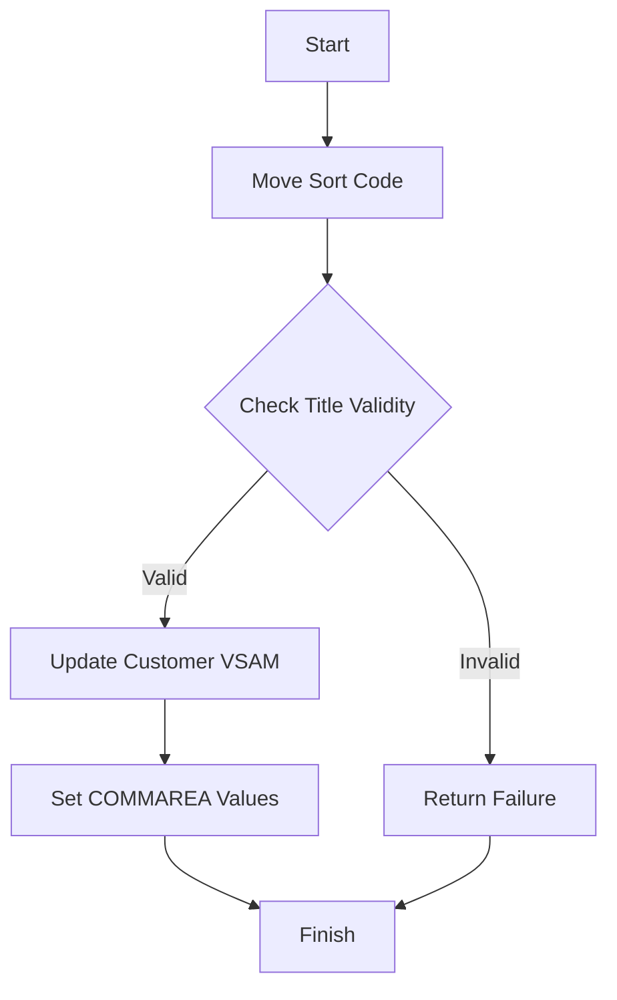

This document will cover the UPDCUST program. We'll cover:

1. What the Program Does
2. Program Flow
3. Program Sections

## What the Program Does

The UPDCUST program is designed to update customer details in the VSAM datastore. It receives all fields that make up the customer record as input. The program ensures that only a limited number of fields can be changed and does not write any record to PROCTRAN. The presentation layer is responsible for validating the fields. If the customer cannot be updated, a failure flag is returned to the calling program.

## Program Flow

This is a visualization of the flow:



<SwmSnippet path="/src/base/cobol_src/UPDCUST.cbl" line="136">

---

### PREMIERE SECTION

First, the program moves the sort code to the desired sort code. It then checks if the customer's title is valid. If the title is invalid, it sets the update success flag to 'N' and the update failure code to 'T', then exits. If the title is valid, it proceeds to update the customer VSAM.

```cobol
       PROCEDURE DIVISION.
       PREMIERE SECTION.
       A010.

           MOVE SORTCODE TO COMM-SCODE
                            DESIRED-SORT-CODE.

      *
      *    You can change the customer's name, but the title must
      *    be a valid one. Check that here
      *
           MOVE SPACES TO WS-UNSTR-TITLE.
           UNSTRING COMM-NAME DELIMITED BY SPACE
              INTO WS-UNSTR-TITLE.

           MOVE ' ' TO WS-TITLE-VALID.

           EVALUATE WS-UNSTR-TITLE
              WHEN 'Professor'
                 MOVE 'Y' TO WS-TITLE-VALID

```

---

</SwmSnippet>

<SwmSnippet path="/src/base/cobol_src/UPDCUST.cbl" line="210">

---

### <SwmToken path="src/base/cobol_src/UPDCUST.cbl" pos="211:1:5" line-data="       UPDATE-CUSTOMER-VSAM SECTION.">`UPDATE-CUSTOMER-VSAM`</SwmToken> SECTION

Next, the program positions at the matching customer record and locks it. If the read is unsuccessful, it sets the update success flag to 'N' and the appropriate failure code, then exits. If the read is successful, it checks if the name and address fields are valid. If both fields are invalid, it sets the update success flag to 'N' and the failure code to '4', then exits. If the fields are valid, it updates the customer record and rewrites it to the VSAM datastore. If the rewrite is unsuccessful, it sets the update success flag to 'N' and the failure code to '3', then exits. If the rewrite is successful, it sets the success code and updates the COMMAREA values.

```cobol

       UPDATE-CUSTOMER-VSAM SECTION.
       UCV010.

      *
      *    Position at the matching CUSTOMER record and
      *    lock it.
      *
           MOVE COMM-CUSTNO TO DESIRED-CUSTNO.

           EXEC CICS READ FILE('CUSTOMER')
                RIDFLD(DESIRED-CUST-KEY)
                INTO(WS-CUST-DATA)
                UPDATE
                RESP(WS-CICS-RESP)
                RESP2(WS-CICS-RESP2)
           END-EXEC.

      *
      *    Check that the READ was successful. If not mark the return
      *    field as not successful
```

---

</SwmSnippet>

<SwmSnippet path="/src/base/cobol_src/UPDCUST.cbl" line="338">

---

### <SwmToken path="src/base/cobol_src/UPDCUST.cbl" pos="339:1:9" line-data="       GET-ME-OUT-OF-HERE SECTION.">`GET-ME-OUT-OF-HERE`</SwmToken> SECTION

Then, the program executes the CICS RETURN command to return control to the calling program.

```cobol

       GET-ME-OUT-OF-HERE SECTION.
       GMOOH010.

           EXEC CICS RETURN
           END-EXEC.

       GMOOH999.
           EXIT.
```

---

</SwmSnippet>

<SwmSnippet path="/src/base/cobol_src/UPDCUST.cbl" line="348">

---

### <SwmToken path="src/base/cobol_src/UPDCUST.cbl" pos="349:1:5" line-data="       POPULATE-TIME-DATE SECTION.">`POPULATE-TIME-DATE`</SwmToken> SECTION

Finally, the program populates the current time and date using the CICS ASKTIME and FORMATTIME commands.

```cobol

       POPULATE-TIME-DATE SECTION.
       PTD010.

           EXEC CICS ASKTIME
              ABSTIME(WS-U-TIME)
           END-EXEC.

           EXEC CICS FORMATTIME
                     ABSTIME(WS-U-TIME)
                     DDMMYYYY(WS-ORIG-DATE)
                     TIME(WS-TIME-NOW)
                     DATESEP
           END-EXEC.

       PTD999.
           EXIT.
```

---

</SwmSnippet>

&nbsp;

*This is an auto-generated document by Swimm 🌊 and has not yet been verified by a human*

<SwmMeta version="3.0.0" repo-id="Z2l0aHViJTNBJTNBY2ljcy1iYW5raW5nLXNhbXBsZS1hcHBsaWNhdGlvbi1jYnNhLUlCTS1EZW1vLUdQVCUzQSUzQVN3aW1tLURlbW8=" repo-name="cics-banking-sample-application-cbsa-IBM-Demo-GPT"><sup>Powered by [Swimm](/)</sup></SwmMeta>
